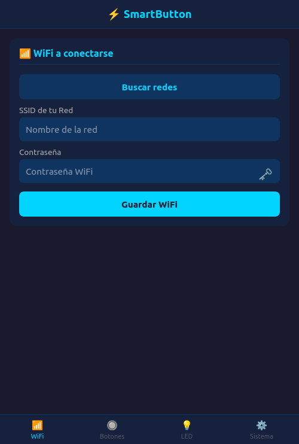
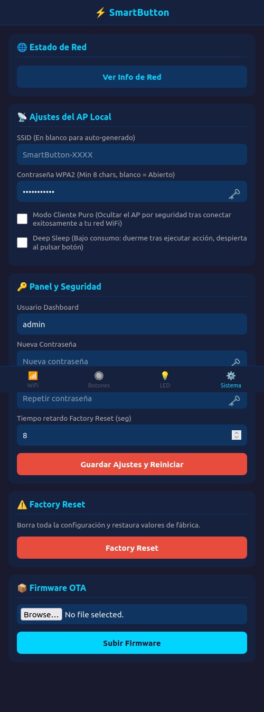
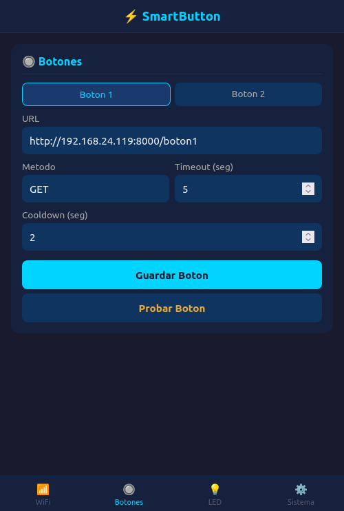

# SmartButton

[](https://github.com/espressif/esp-idf)
[](https://www.espressif.com/en/products/socs/esp32-c6)
[](LICENSE)

Botón IoT dual configurable basado en ESP32-C6. Pulsa un botón físico y ejecuta una petición HTTP/HTTPS a la URL que quieras. Configurable fácilmente desde cualquier dispositivo vía portal web captivo.

## Características

- **2 botones físicos** con URL configurable cada uno (GET o POST).
- **Portal web captivo** — al conectarte a su red, se abre automáticamente.
- **Interfaz Bootstrap Dark** — panel responsive con estilo Bootstrap 5 oscuro.
- **Escaneo WiFi** desde la web para seleccionar tu red visualmente.
- **HTTPS nativo** — soporte TLS integrado mediante `esp_crt_bundle` para llamar APIs seguras.
- **Autenticación** con usuario/contraseña (por defecto `admin`/`admin`).
- **Cooldown y Timeout** — anti-spam de pulsaciones y control de tiempo de espera HTTP.
- **Deep Sleep** — modo ultra bajo consumo que despierta al pulsar un botón y ejecuta la acción correspondiente.
- **Modo Cliente Puro** — oculta el AP propio tras conectar a tu red WiFi para mayor seguridad.
- **AP configurable** — SSID y contraseña del punto de acceso personalizables (abierto o WPA2).
- **Feedback visual RTOS** — LED RGB WS2812 con notificaciones FreeRTOS en tiempo real.
- **Botón de test** para probar las llamadas HTTP desde el propio panel web.
- **Factory reset dinámico** — mantén ambos botones (tiempo configurable desde la web).
- **Actualizaciones OTA** — sube nuevos firmwares `.bin` directamente desde el panel de control.
- **Fallback automático** — si falla la conexión WiFi tras 5 reintentos, vuelve a crear su propio AP.
  
## Imágenes

<center>
  <table>
    <tr>
      <td></td>
      <td rowspan="2"></td>
    </tr>
    <tr>
      <td></td>
    </tr>
  </table>
</center>

## Hardware

### MCU

- **ESP32-C6** (RISC-V, WiFi 6, BLE 5)
- Flash: **16MB**

### Pinout

| Función | GPIO | Configuración |
|---------|------|---------------|
| Botón 1 | **GPIO 4** | Pull-up interno, active-low |
| Botón 2 | **GPIO 5** | Pull-up interno, active-low |
| LED RGB | **GPIO 8** | Salida digital (Protocolo WS2812 / NeoPixel) |

### Esquema de conexión

*Nota: Se asume el uso de un LED RGB direccionable tipo WS2812 (NeoPixel).*

```text
ESP32-C6
┌──────────┐
│ GPIO 4   ├──── BTN1 ──── GND
│ GPIO 5   ├──── BTN2 ──── GND
│          │
│ GPIO 8   ├──── Data IN (LED WS2812)
│ 5V / 3V3 ├──── VDD     (LED WS2812)
│ GND      ├──── GND     (LED WS2812 / Común)
└──────────┘
```

Los botones son **normalmente abiertos** (NO). Al pulsar conectan el GPIO a GND. No necesitan resistencia externa — el firmware activa el pull-up interno del ESP32.

## Instalación

### Requisitos

- [ESP-IDF v5.2+](https://docs.espressif.com/projects/esp-idf/en/latest/esp32c6/get-started/) configurado y activo.
- Placa ESP32-C6 (Flash recomendada: 16MB).

### Clonar y compilar

```bash
git clone https://github.com/soyunomas/esp32_smartbutton.git
cd esp32_smartbutton

# Configurar entorno ESP-IDF (si no lo tienes en tu .bashrc/.zshrc)
. $HOME/esp/esp-idf/export.sh

# Compilar
idf.py build

# Flashear primera vez (borra NVS anterior para asegurar limpieza)
# Cambia /dev/ttyUSB0 por tu puerto correspondiente (COMx en Windows)
idf.py -p /dev/ttyUSB0 erase_flash flash monitor

# Flashear futuras actualizaciones por cable (conserva configuración WiFi/Botones)
idf.py -p /dev/ttyUSB0 flash monitor
```

## Uso Normal

### Primera configuración

1. **Alimenta** el dispositivo.
2. Desde tu móvil/PC, busca la red WiFi **`SmartButton-XXXX`**.
3. El portal de configuración se abre automáticamente (o navega a `http://192.168.4.1`).
4. Inicia sesión con **admin** / **admin**.
5. Ve a **WiFi**, escanea tu red, selecciónala y pon la contraseña.
6. En **Botones**, configura las llamadas HTTP que necesites.
7. Guarda. El dispositivo se reiniciará y se conectará a tu red.

### Comportamiento del LED RGB

El dispositivo cuenta con un sistema de estados RTOS que responde **al instante** mediante notificaciones FreeRTOS:

| Estado | Color LED | Patrón de parpadeo |
|--------|-----------|--------------------|
| **Modo AP (Configuración)** | 🔵 Azul | Parpadeo lento (1s) |
| **Conectando a WiFi** | 🟡 Amarillo | Parpadeo rápido (200ms) |
| **Conectado / Listo** | 🟢 Verde | **Fijo** |
| **Procesando Petición** | 🌐 Cyan | Pulso hiperrápido (150ms) |
| **Petición Exitosa (HTTP 2xx)**| 🟢 Verde | Flash brillante de 1 segundo |
| **Error (Timeout / Fallo)** | 🔴 Rojo | Triple flash rápido |
| **Aviso de Reset Inminente** | 🔴 Rojo | Parpadeo muy rápido (100ms) |
| **Reset en curso** | 🔴 Rojo | **Fijo** |
| **Entrando en Deep Sleep** | 🔵 Azul | Flash breve de despedida |

### Deep Sleep (Modo bajo consumo)

Activable desde **Sistema > Deep Sleep** en el panel web. Ideal para dispositivos alimentados por batería.

- **Arranque en frío** (primera alimentación o reset): el dispositivo permanece despierto **3 minutos** para permitir acceso al panel de configuración y luego entra en deep sleep.
- **Despertar por botón**: al pulsar cualquiera de los dos botones, el dispositivo despierta, conecta a WiFi, ejecuta la petición HTTP del botón correspondiente y vuelve a dormir automáticamente.
- **Detección temprana del botón**: el GPIO se lee al inicio mismo del arranque (antes de cualquier inicialización) para identificar correctamente qué botón despertó el dispositivo.
- **Timeout de seguridad**: si la petición no se completa en 30 segundos, el dispositivo vuelve a dormir igualmente.

### Modo Cliente Puro

Activable desde **Sistema > Modo Cliente Puro**. Oculta el punto de acceso propio (`SmartButton-XXXX`) una vez conectado exitosamente a tu red WiFi. Útil para mayor seguridad en entornos de producción. Si la conexión falla tras 5 reintentos, el AP se reactiva automáticamente como fallback.

### Factory Reset (Restaurar de fábrica)

Mantén **ambos botones pulsados simultáneamente**. Por defecto el tiempo es de 8 segundos (configurable en la web). 

- **Fase 1 (0 a T-3 seg):** El LED parpadea lento advirtiendo de la pulsación prolongada. Si sueltas los botones, la acción se cancela y se retoma la normalidad.
- **Fase 2 (Últimos 3 seg):** El LED parpadeará en rojo rápidamente advirtiendo del borrado inminente.
- **Fase 3 (Fin del tiempo):** El LED se queda en Rojo fijo, la placa se formatea por completo (borrando NVS) y vuelve a iniciar en Modo AP de fábrica.

También se puede realizar Factory Reset desde el panel web en **Sistema > Factory Reset**.

## Configuración de los Botones

Desde la web puedes ajustar parámetros avanzados por cada botón:

| Parámetro | Descripción |
|-----------|-------------|
| **URL** | Dirección a llamar — soporta HTTP y HTTPS (ej: `https://api.ejemplo.com/webhook`) |
| **Método** | `GET` o `POST` |
| **Payload** | Cuerpo de la petición (JSON) si eliges POST |
| **Timeout** | Tiempo máximo a esperar la respuesta del servidor (1 a 30 seg) |
| **Cooldown**| Tiempo de enfriamiento anti-spam entre pulsaciones (0.5 a 60 seg) |

## Configuración del AP

Desde **Sistema > Ajustes del AP Local** puedes personalizar el punto de acceso:

| Parámetro | Descripción |
|-----------|-------------|
| **SSID** | Nombre personalizado de la red AP. En blanco genera `SmartButton-XXXX` automáticamente |
| **Contraseña WPA2** | Mínimo 8 caracteres para activar cifrado WPA2. En blanco = red abierta |
| **Modo Cliente Puro** | Oculta el AP tras conectar exitosamente a tu red WiFi |
| **Deep Sleep** | Activa el modo bajo consumo (duerme tras ejecutar acción) |

## Arquitectura del Software

Este proyecto está diseñado en **C** con **ESP-IDF** y divide sus responsabilidades en componentes débilmente acoplados:

- `app_core`: Máquina de estados global, gestión de Event Groups.
- `app_nvs`: Capa de persistencia en Flash (NVS) para WiFi, credenciales, botones y ajustes de sistema.
- `app_wifi`: Modos STA, AP y APSTA con fallback automático tras 5 reintentos fallidos.
- `app_web`: Servidor HTTP, interfaz de usuario embebida (`html_ui.h`) y endpoints REST con autenticación Basic Auth.
- `app_http`: Cliente HTTP/HTTPS asíncrono con TLS via `esp_crt_bundle`, ejecutado en tarea independiente.
- `app_buttons`: Polling GPIO anti-rebotes con lógica dinámica para Factory Reset.
- `app_led`: Feedback visual en tiempo real usando `led_strip` (WS2812) y notificaciones RTOS (`xTaskNotify`).
- `app_dns`: Servidor DNS ultraligero para secuestro web (Captive Portal).

### Endpoints del API REST

La interfaz embebida interactúa con la placa mediante las siguientes rutas HTTP (protegidas con Basic Auth):

| Endpoint | Método | Uso |
|----------|--------|-----|
| `/` | `GET` | Carga el portal (HTML/CSS/JS embebido) |
| `/api/verify` | `GET` | Validación de credenciales de sesión |
| `/api/scan` | `GET` | Devuelve JSON con redes WiFi cercanas (RSSI y Auth) |
| `/api/wifi` | `POST`| Guarda SSID y Password y reinicia |
| `/api/btn?id=N` | `GET` | Recupera los ajustes actuales de un botón |
| `/api/btn` | `POST`| Guarda configuración del botón (URL, método, etc.) |
| `/api/test` | `POST`| Realiza una prueba sincrónica HTTP y devuelve el código |
| `/api/netinfo`| `GET` | Devuelve IPs, MAC, Gateway y estado de red actual |
| `/api/admin` | `GET/POST` | Recupera o cambia credenciales de admin, AP y ajustes de sistema |
| `/api/factory_reset` | `POST` | Borra toda la NVS y reinicia con valores de fábrica |
| `/api/ota` | `POST`| Recibe un binario y ejecuta actualización de firmware |

## Tabla de particiones

Configurada con soporte Dual OTA para que el firmware nunca se corrompa en caso de corte de energía durante una actualización vía web.

| Nombre | Tipo | Subtipo | Tamaño |
|-----------|------|---------|--------|
| nvs | data | nvs | 24 KB |
| otadata | data | ota | 8 KB |
| phy_init | data | phy | 4 KB |
| factory | app | factory | 2 MB |
| ota_0 | app | ota_0 | 2 MB |
| ota_1 | app | ota_1 | 2 MB |
| storage | data | spiffs | 1 MB |

## Licencia

Este proyecto se distribuye bajo la licencia **MIT**. Puedes usarlo, modificarlo y distribuirlo libremente.
